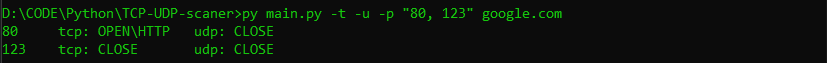
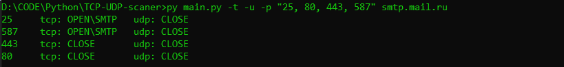
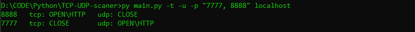

Scanner TCP-UDP
===============

Автор: Меньшиков Александр Сергеевич  
Группа: КН-202

Описание
--------

Scanner TCP-UDP - консольная утилита, разработанная для сканирования TCP и UDP портов на указанном хосте. Утилита способна определить протокол, который работает на открытом порту, такие как HTTP, SMTP, POP3, SNTP и другие.

Принцип работы
--------------

Scanner TCP-UDP использует сокеты для установления соединений с портами на указанном хосте и проверки их доступности. Для сканирования TCP портов используется подход с установлением соединения (connect), а для сканирования UDP портов используется отправка и прием пакетов данных.

Утилита позволяет сканировать заданный диапазон портов на указанном хосте и выводить информацию о доступности портов и определенном на них протоколе.  

Благодаря параллельной обработке, утилита Scanner TCP-UDP может эффективно сканировать порты и быстро предоставлять результаты сканирования.

Использование
-------------
Для получения справки используйте `-h` или `--help`:
```shell
py main.py -h
```
Справка:
```shell
usage: main.py [-h] [-t] [-u] [-p PORTS] host  

positional arguments:
   host                  this host will be scanned.
    
optional arguments:
   -h, --help            show this help message and exit
   -t                    the program will scan tcp ports.
   -u                    the program will scan udp ports.
   -p PORTS, --ports PORTS
                         this port range will be scanned.
```

Пример работы:
==============


В реальной среде результаты сканирования UDP портов могут быть некорректными из-за различных проблем, описанных в условии задачи.
Для демонстрации работоспособности утилиты поднимем два сервера на localhost: 

**Сервер 1**

*   Порт: 7777
*   Протокол: UDP
*   Протокол приложения: HTTP

**Сервер 2**

* Порт: 8888
* Протокол: TCP
* Протокол приложения: HTTP

Результат сканирования:



